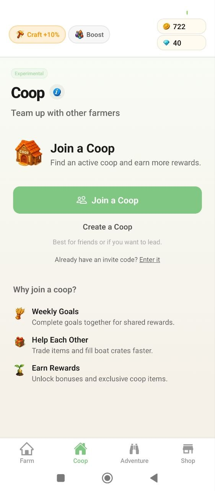
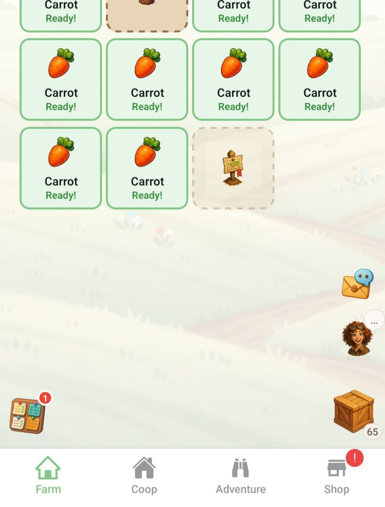

# Ravolo

<p align="center">
  
</p>

<p align="center">
  <strong>Ravolo</strong> is an addictive, high-frequency MMO farming simulator built for mobile platforms using Expo and React Native. The game emphasizes real-time micro-economies, strict time-management mechanics (FOMO), and dynamic player interactions.
</p>

## Demo Gameplay

| Farm Gameplay | App Home |
| :---: | :---: |
|  |  |

| Buy and Sell | Coop |
| :---: | :---: |
|  |  |

| Coxy | Test Build |
| :---: | :---: |
|  |  |

## Key Features

- **High-Frequency Performance:** Driven by heavily optimized WebSockets and MessagePack (`msgpackr`) binary frames for blazing-fast payload transmission, minimal battery drain, and instant UI updates.
- **FOMO Mechanics:** Crops wither if ignored. Animals get sad, then sick. A fleeting Black Market Trader forces players to log in regularly.
- **Social & Economic Warfare:** Join Syndicates (Cartels) to manipulate market commodities, send gifts via P2P transfers, or coordinate protests against mega-rich farmers to trigger punishing tax decrees.
- **Global Server Systems:** Watch the dynamic live leaderboard, contribute to massive global server bounties, and experience a progressive wealth tax that balances the economy.
- **Offline Capabilities:** Local-first architecture allows you to manage crops and animals on the go, synchronizing seamlessly with the server when reconnected.

## Documentation

- [**Detailed Architecture**](file:///c:/Users/NCC/Documents/ravolo/architecture.md): Deep dive into the local-first sync, WebSocket strategy, and anti-cheating measures.
- [**Feature Roadmap**](file:///c:/Users/NCC/Documents/ravolo/features.md): Comprehensive list of all MMO and FOMO mechanics.

## Tech Stack

| Layer                | Technology                                                              |
| :------------------- | :---------------------------------------------------------------------- |
| **Frontend**         | React Native (Expo SDK 54), TypeScript                                  |
| **Persistence**      | WatermelonDB (SQLite)                                                   |
| **Networking**       | high-frequency WebSockets + MessagePack (`msgpackr`, binary frames)     |
| **State Management** | Zustand (Client) + TanStack Query (Server)                              |
| **Backend**          | Bun (TypeScript strict) API/WS server + Worker, Redis + BullMQ, Supabase Postgres, Solana (`@solana/kit`) |

## Backend (`ravolo-backend`)

The game backend lives in [`../ravolo-backend`](../ravolo-backend) and runs on [Bun](https://bun.sh):

- **API/WS Server** (`src/server.ts`) — `Bun.serve` HTTP + WebSocket, wallet auth (Ed25519 challenge/verify, JWT in Redis sessions), enqueues BullMQ jobs, reads prices from Redis.
- **Worker** (`src/worker.ts`) — builds/signs/broadcasts sponsored Solana transactions, onboards users, syncs on-chain inventory, provisions offline nonce accounts.
- **Realtime protocol** — binary-only WebSocket frames via `msgpackr` at `ws://<host>:<PORT>/api/ws?token=<jwt>`.
- **Data** — Solana SPL tokens are the source of truth for assets; Redis caches inventory/prices/sessions; Supabase Postgres stores user profiles/audit; live BTC/SOL/XRP price ticks derive all commodity prices.

Run both processes: `bun run dev:all` (see `ravolo-backend/README.md` for env setup).

## Getting Started

1. **Install dependencies**

   ```bash
   npm install
   ```

2. **Start the development server**

   ```bash
   npx expo start
   ```

3. **Check out the architecture**
   Read through [architecture.md](file:///c:/Users/NCC/Documents/ravolo/architecture.md) to understand the sync logic before making changes to the data layer.
